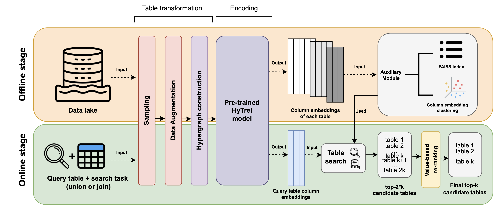

# HEARTS: Hypergraph-based Related Table Search



📌 **Presented as a poster at the ELLIS workshop on Representation Learning and Generative Models for Structured Data (RLGMSD 2024), Amsterdam, Netherlands, Feb 27, 2025**  

🔗 **Extended Abstract:** [Read on OpenReview](https://openreview.net/pdf?id=XgRbxO9pLJ)  
📜 **Download the Poster:** [HEARTS Poster](images/Poster%20HEARTS%20ELISS%20Workshop.pdf)  
🌐 **Workshop Link:** [RLGMSD 2024](https://sites.google.com/view/rl-and-gm-for-sd/home)  

---

## 🔍 Introduction to HEARTS

Recent methods for related table search rely on tabular representation learning and language models to encode tables into vector representations for efficient semantic search. However, a key challenge is maintaining essential structural properties of tabular data. 

📌 **Enter HEARTS**, a related-table search system powered by **HyTrel** [1], a **hypergraph-enhanced Tabular Language Model (TaLM)**. By modeling tables as hypergraphs with **cells as nodes** and **rows, columns, and tables as hyperedges**, **HyTrel preserves relational properties** such as row and column order invariance, making it a robust solution for related table search tasks.

---

## ⚙️ Setup Instructions

### 1️⃣ Environment Setup

Set up the environment using Conda:

```bash
# Create the conda environment
conda env create -f environment.yml

# Activate the environment
conda activate hearts

# Run the initial setup script
bash setup.sh
```

These commands install all required dependencies and configure your environment for the project.

---

### 2️⃣ Download Benchmarks & Pretrained Checkpoints

You can **automatically** download all necessary checkpoints and benchmarks using `download.sh` or **manually** from the links below.

#### ✅ Automatic Download (Recommended)

```bash
bash download.sh
```

#### 🔗 Manual Download

| Component   | Description                    | Download Link |
|-------------|--------------------------------|---------------|
| **HyTrel**  | Pretrained HyTrel checkpoint [1] | [Download](https://nuage.lip6.fr/index.php/s/LW6qQZ4jeNkBNSW/download/hytrel.tar.gz) |
| **Fasttext**| Pretrained Fasttext model [11]     | [Download](https://nuage.lip6.fr/index.php/s/KYYXfGncwiFSKd7/download/fasttext.tar.gz) |

| Benchmark    | Description | Download Link |
|--------------|------------|---------------|
| **Santos**   | Santos Benchmark [6]  | [Download](https://nuage.lip6.fr/index.php/s/dXZ9fbtXfsptHoZ/download/santos.tar.gz) |
| **TUS**      | Table Union Search Benchmark [5]  | [Download](https://nuage.lip6.fr/index.php/s/Np5CLbENHWwHrzF/download/tus.tar.gz) |
| **TUS Large**| Large-Scale TUS Benchmark [5]  | [Download](https://nuage.lip6.fr/index.php/s/cJJwtdzW6Nt6ssb/download/tusLarge.tar.gz) |
| **Wiki-Join**| Wiki-Join Benchmark (modified to handle self-matching and Jaccard > 0.5 ground truth entries) [4,10]  | [Download](https://nuage.lip6.fr/index.php/s/LKWeDCZ9MQcTMCN/download/wiki-join.tar.gz) |

📢 **Disclaimer:** We do not own or claim any rights over these benchmarks or models. We have reuploaded them only to facilitate easy access. Please refer to the original repositories for their sources.

---

### 3️⃣ Create Column-Shuffled Versions for Table Union Search

To test HEARTS under adversarial conditions (randomly shuffled columns), run:

```bash
bash prepare_data.sh
```

---

### 4️⃣ Running the Evaluation Pipelines

#### 💞 **HEARTS**
```bash
bash shell/hytrel/run_all.sh
```

#### ⭐ **Starmie [2]**
```bash
bash shell/starmie/run_all.sh
```

#### 🌪️ **DeepJoin (Notebook-based Evaluation) [3]**
```bash
jupyter notebook notebooks/deepjoin.ipynb
```

---

### 5️⃣ Visualizing the Results 📊

```bash
jupyter notebook notebooks/visualize.ipynb
```

---

## 📢 Citation

If you use this code or any part of HEARTS in your research, please cite us using the following reference:

```bibtex
@inproceedings{boutaleb2025hearts,
  title={{HEARTS}: Hypergraph-based Related Table Search},
  author={Allaa Boutaleb and Alaa Almutawa and Bernd Amann and Rafael Angarita and Hubert Naacke},
  booktitle={ELLIS workshop on Representation Learning and Generative Models for Structured Data},
  year={2025},
  url={https://openreview.net/forum?id=XgRbxO9pLJ}
}
```

---

## 📚 References

[1] P. Chen, S. Sarkar, L. Lausen, B. Srinivasan, S. Zha, R. Huang, and G. Karypis. Hytrel: Hypergraph-enhanced tabular data representation learning. In Advances in Neural Information Processing Systems (NeurIPS), 2024.

[2] G. Fan, J. Wang, Y. Li, D. Zhang, and R. J. Miller. STARMIE: Semantics-aware dataset discovery from data lakes. In Proceedings of the VLDB Endowment (PVLDB), 16(7):1726–1739, 2023.

[3] Y. Dong, C. Xiao, T. Nozawa, M. Enomoto, and M. Oyamada. DeepJoin: Joinable table discovery with pre-trained language models. In IEEE Transactions on Knowledge and Data Engineering (TKDE), 2023.

[4] K. Srinivas, J. Dolby, I. Abdelaziz, O. Hassanzadeh, H. Kokel, A. Khatiwada, T. Pedapati, S. Chaudhury, and H. Samulowitz. LakeBench: Benchmarks for data discovery over data lakes. In arXiv preprint arXiv:2307.04217, 2023.

[5] F. Nargesian, E. Zhu, K. Q. Pu, and R. J. Miller. TUS: Table union search on open data. In Proceedings of the VLDB Endowment (PVLDB), 11(7):813–825, 2018.

[6] A. Khatiwada, G. Fan, R. Shraga, Z. Chen, W. Gatterbauer, R. J. Miller, and M. Riedewald. SANTOS: Relationship-based semantic table union search. In Proceedings of the ACM on Management of Data (SIGMOD), 1(1):1–25, 2023.

[7] Douze, M., Guzhva, A., Deng, C., et al. (2024) - The Faiss Library. arXiv preprint arXiv:2401.08281.

[8] McInnes, L., Healy, J., Astels, S., et al. (2017) - HDBSCAN: Hierarchical Density-Based Clustering. JOSS, 2(11), 205.

[9] McInnes, L., Healy, J., Saul, N., and Grossberger, L. (2018) - UMAP: Uniform Manifold Approximation and Projection. JOSS, 3(29), 861.

[10] Khatiwada, A., Kokel, H., Abdelaziz, I., et al. (2025) - TabSketchFM: Sketch-based Tabular Representation Learning for Data Discovery over Data Lakes. IEEE ICDE.

[11] Mikolov, T., Grave, E., Bojanowski, P., Puhrsch, C., & Joulin, A. (2018). Advances in Pre-Training Distributed Word Representations. In Proceedings of the International Conference on Language Resources and Evaluation (LREC 2018).
